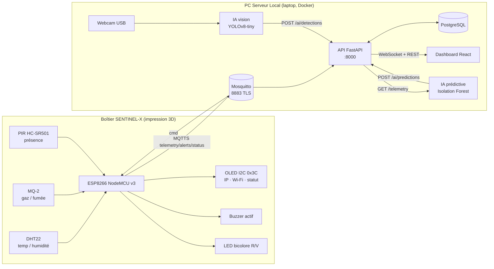

# Architecture Sentinel-X — Groupe 1 (option B)

À faire valider par les coachs lundi. Les choix ci-dessous sont figés pour le sprint.

## 1. Vue d'ensemble

## 2. Réseau de table

| Élément                 | Valeur                                   |
|-------------------------|------------------------------------------|
| Sous-réseau             | `192.168.10.0/24`                        |
| Point d'accès Wi-Fi     | laptop serveur (hotspot) ou routeur dédié, SSID `SENTINEL-G1`, WPA2 |
| Serveur (API, broker)   | `192.168.10.1` (statique)                |
| ESP8266                 | `192.168.10.50` (réservation DHCP ou IP statique dans le firmware) |
| Postes des apprenants   | `192.168.10.100-199` (DHCP)              |
| Isolation               | pas de routage vers les autres tables ; seul le serveur a accès Internet si besoin |

Ports exposés sur le serveur (à aligner avec UFW au durcissement) :

| Port  | Service                   | Ouvert à                      |
|-------|---------------------------|-------------------------------|
| 8883  | MQTTS                     | ESP8266, scripts IA           |
| 1883  | MQTT clair (debug)        | localhost uniquement, fermé jeudi |
| 8000  | API REST + WebSocket      | postes du groupe              |
| 8080  | Dashboard (nginx, auth basic) | postes du groupe / jury   |
| 22    | SSH (clés uniquement)     | postes du groupe              |

## 3. Flux de données

1. L'ESP lit les capteurs toutes les 2 s, publie une télémétrie toutes les 5 s et une alerte à chaque franchissement de seuil local.
2. Mosquitto authentifie l'ESP (login/mot de passe) sur une session TLS vérifiée côté ESP (CA locale).
3. L'API s'abonne à `sentinel/g1/#`, persiste en base et pousse immédiatement l'événement aux dashboards connectés en WebSocket.
4. Le superviseur déclenche buzzer/LED depuis le dashboard : `POST /commands` → publication MQTT `sentinel/g1/cmd` → ESP.
5. Le script de vision lit la webcam (640x480), infère, et pousse chaque détection de personne à l'API.
6. Le modèle prédictif relit l'historique télémétrie, calcule un score d'anomalie sur fenêtre glissante et le pousse à l'API.

## 4. Choix justifiés

- **FastAPI** : async natif pour le WebSocket, validation Pydantic alignée sur le contrat, doc OpenAPI automatique pour le jury.
- **MQTT plutôt que HTTP depuis l'ESP** : léger, reconnexion et Last Will intégrés, un seul lien TLS à maintenir.
- **PostgreSQL** : séries temporelles simples avec index sur `ts`, suffisant pour 4 jours et exploitable par Scikit-Learn.
- **Isolation Forest** : non supervisé, pas besoin de données étiquetées d'incident, capte la corrélation lente temp + gaz exigée par le sujet.
