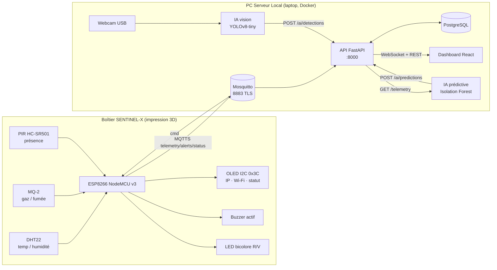

# Architecture Sentinel-X — Groupe 1 (option B)

Choix validés par les coachs, figés pour le sprint.

## 1. Vue d'ensemble

## 2. Réseau de table

Cible : réseau de table isolé, SSID `SENTINEL-G1`, WPA2, 2,4 GHz, serveur en `192.168.10.1` statique. Faute de routeur dédié pendant le sprint, la démonstration tourne sur un **hotspot Wi-Fi partagé** : le serveur reçoit son IP par DHCP (p. ex. `192.168.137.53`) et l'ESP la sienne (p. ex. `192.168.137.244`). L'épinglage du certificat sur l'ESP porte sur l'empreinte, pas sur l'IP, donc le changement d'adresse n'affecte pas la connexion TLS. Seuls le SSID, le mot de passe et `MQTT_HOST` (IP du serveur) sont à mettre à jour dans `firmware/include/secrets.h` puis reflasher.

| Élément                 | Valeur (démo sur hotspot)                |
|-------------------------|------------------------------------------|
| Serveur (API, broker)   | IP DHCP du laptop, reportée dans `MQTT_HOST` |
| ESP8266                 | IP DHCP, client MQTTS uniquement         |
| Postes du groupe / jury | même hotspot, dashboard par mot de passe |

Ports exposés sur le serveur (à aligner au durcissement) :

| Port  | Service                   | Ouvert à                      |
|-------|---------------------------|-------------------------------|
| 8883  | MQTTS                     | ESP8266, scripts IA           |
| 1883  | MQTT clair (debug)        | localhost uniquement, à fermer au durcissement |
| 8000 (→ 8010 sur l'hôte) | API REST + WebSocket   | postes du groupe              |
| 8080  | Dashboard (nginx, auth basic) | postes du groupe / jury   |
| 22    | SSH (clés uniquement)     | postes du groupe              |

Détection en direct pendant le pentest : `infra/scripts/watch-attacks.sh` surligne les connexions d'IP inconnues, les échecs d'authentification HTTP/MQTT et les scans de chemins. Lecture seule.

## 3. Flux de données

1. L'ESP lit les capteurs toutes les 2 s, publie une télémétrie toutes les 5 s et une alerte à chaque franchissement de seuil local.
2. Mosquitto authentifie l'ESP (login/mot de passe, anonyme refusé) sur une session TLS que l'ESP vérifie par l'empreinte du certificat serveur (épinglage ; variante par CA locale disponible).
3. L'API s'abonne à `sentinel/g1/#`, persiste en base et pousse immédiatement l'événement aux dashboards connectés en WebSocket.
4. Le superviseur déclenche buzzer/LED depuis le dashboard : `POST /commands` → publication MQTT `sentinel/g1/cmd` → ESP.
5. Le script de vision lit la webcam (640x480), infère, et pousse chaque détection de personne à l'API.
6. Le modèle prédictif relit l'historique télémétrie, calcule un score d'anomalie sur fenêtre glissante et le pousse à l'API.

## 4. Choix justifiés

- **FastAPI** : async natif pour le WebSocket, validation Pydantic alignée sur le contrat, doc OpenAPI automatique pour le jury.
- **MQTT plutôt que HTTP depuis l'ESP** : léger, reconnexion et Last Will intégrés, un seul lien TLS à maintenir.
- **PostgreSQL** : séries temporelles simples avec index sur `ts`, suffisant pour 4 jours et exploitable par Scikit-Learn.
- **Isolation Forest** : non supervisé, pas besoin de données étiquetées d'incident, capte la corrélation lente temp + gaz exigée par le sujet.
